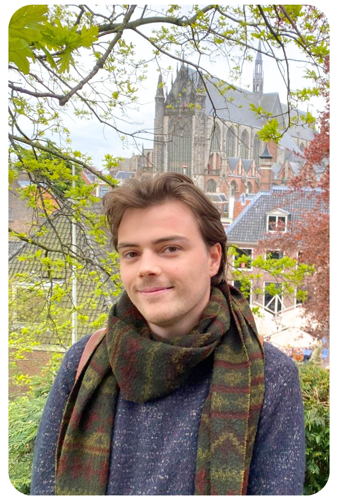
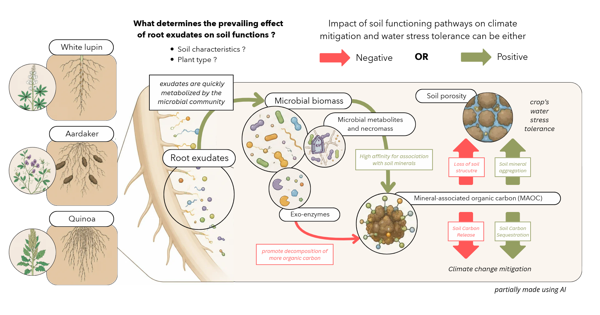
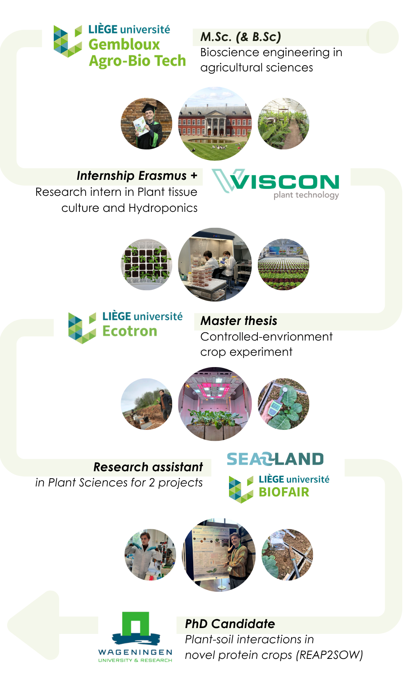

<div style="text-align: justify;">

# Hi, I am Lucas

```{=html}

<div style="
  display: flex;
  align-items: flex-start;
  gap: 2rem;
  max-width: 1100px;
  margin: 0 auto;
">

  <!-- PROFILE IMAGE -->

  <div style="
    flex-shrink: 0;
  ">

    
  </div>

  <!-- TEXT -->

  <div style="
    text-align: justify;
    max-width: 760px;
  ">

After graduating from a Master in Bioscience Engineering in Agricultural Sciences at the <a href="https://www.uliege.be/cms/c_8699436/en/uliege" style="text-decoration: none;">University of Liège</a> in Belgium, I worked as a research assistant at the <i>Plant Genetics and Rhizosphere Processes Laboratory</i> of <a href="https://www.gembloux.uliege.be/cms/c_4039827/en/gembloux-agro-bio-tech" style="text-decoration: none;">Gembloux Agro-Bio Tech</a>.

Motivated by the desire to learn more about sustainable agriculture and how plants interact with their environment, I set out to find a research position in the Netherlands. After spending some time caught up in the relentless whirlwind of applications, I finally landed an incredible research opportunity within the REAP2SOW project.

Since June 2026, I have been working as a PhD candidate on the impact of protein crops on soil functions and on the role of root exudates in soil carbon dynamics and climate resilience of these novel cropping systems at <a href="https://www.wur.nl/en" style="text-decoration: none;">Wageningen University</a>.

Besides the academic grind, I am also a plant nerd who likes to visit and volunteer in Botanical Gardens and share fun facts about the plant world !

    </p>

  </div>

</div>

```
## About this website

On this website, you'll find a page dedicated to my scientific [CONTRIBUTIONS](contributions.qmd){style="text-decoration: none;"} with regular updates on my research project, a space on plant-soil related [SCIENCE COMMUNICATION](sci-com.qmd){style="text-decoration: none;"} where you can find small literature reviews of key concepts and conference related content, a [BLOG](blog.qmd){style="text-decoration: none;"} where I share more personal (but still pretty much plant-related) stuff, and finally a photo [GALLERY](gallery.qmd){style="text-decoration: none;"} to highlight some work-related moments.

## My current research topic

Since June 2026, I started my PhD within the REAP2SOW project. This stands for "Resilient and Efficient Agricultural Proteins to Sustain Our World", a Dutch initiative that aims to develop sustainable, climate-resilient food systems by promoting novel plant-based protein crops that are not yet widely used in Europe (including quinoa, white lupin, and tuberous pea). My research work is part of the work package "Soil biodiversity and functioning", where I'll be investigating how these plants secretly feed microbes underground through their root exudates, and how this shapes soil properties such as carbon sequestration and porosity, ultimately affecting the system's resilience towards climate change. We still don't really know exactly what determines the prevailing effect of root exudates on these soil functions but it is very likely crop and soil dependent, and that's what we aim to find out for these three novel protein crops on different type of soils (below I made a little visual if you're curious about the more detailed cascading effects of root exudates on soil functioning).

{width=120% fig-align="center"}

## My background

{width=70% fig-align="center"}

## Latest news

```{=html}
<div class="news-feed news-feed-compact">

  <div class="news-item">
    <div class="news-date">
      <span class="news-month">June</span>
      <span class="news-year">2026</span>
    </div>
    <div class="news-content">
      <span class="news-tag news-tag-milestone">Milestone</span>
      <h3>Started my PhD at the Soil Biology & Soil Geography and Landscapes Groups, Wageningen University</h3>
      <p>Joined the <a href="https://www.nwo.nl/en/projects/ckgah33008">REAP2SOW project</a> as a doctoral researcher, working on plant-soil interactions in novel protein crops.</p>
    </div>
  </div>

  <div class="news-item">
    <div class="news-date">
      <span class="news-month">Jan</span>
      <span class="news-year">2026</span>
    </div>
    <div class="news-content">
      <span class="news-tag news-tag-milestone">Milestone</span>
      <h3>First scientific publication out in Environmental Research: Food Systems (IOP Science)</h3>
      <p>Very proud to announce that my first-ever scientific paper has been published in the context of the <a href="https://sea2landproject.eu/">SEA2LAND H2020 Project ♻️🥦</a>. This work feels particularly special to me, as it grew out of my master’s thesis at the TERRA-Ecotron and my research assistantship at the University of Liège. <a href="https://iopscience.iop.org/article/10.1088/2976-601X/ae2d5b">DOI 10.1088/2976-601X/ae2d5b</a>. </p>
    </div>
  </div>

</div>
</p>
```
</div>