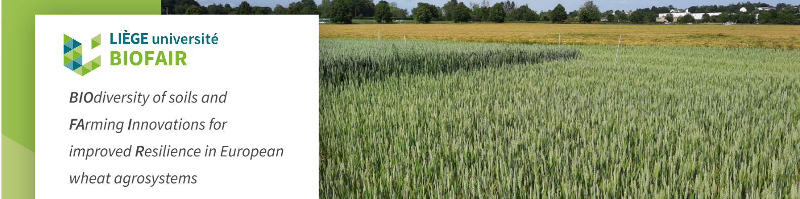

## BIOFAIR : BIOdiversity of soils and FArming Innovations for improved Resilience in European wheat agrosystems

The goal of BIOFAIR is to determine the impact of climate change on the functional soil biome, from microbes to mites, and to identify innovative farming practices that foster soil health and plant productivity in a sustainable way [Link to the project website](https://www.biofair.uliege.be/cms/c_6757815/en/biofair)

## WP2: Innovative farming practices & WP4: Functional soil biodiversity

WP2: A soil biodiversity survey is performed in different long-term field trials where innovative farming practices are compared to conventional practices. The studied factors in these trials have been shown to promote plant-soil interactions and concern 1) soil tillage intensity, 2) organic matter management, 3) nitrogen fertilization strategies and fertilizer placement, 4) use of nitrogen-rich organic fertilizers, 5) use of biostimulants and stress-protective micronutrients, 6) pre-crop selection and more generally 7) the system management (organic versus conventional system).Soil, root and rhizosphere samples are collected for biodiversity studies in WP4. Wheat grains thus produced will be analyzed for their qualitative composition and technological properties (WP5) which, compiled with the soil biodiversity survey, will highlight the farming innovations favoring climate sensitive taxa conservation and production of healthy and nutritious wheat grains.

WP4 will analyze the biodiversity and functioning of soil communities in samples collected in the first three WPs. The targeted communities are 1) organisms of the soil and rhizosphere microbiome (soil bacteria and fungi including arbuscular mycorrhizal fungi) and 2) micro- and mesofauna (nematodes, tardigrades, collembolans, and mites). The structural biodiversity will be assessed by analyzing the abundance, diversity and community composition of phylogenetic and functional soil groups using molecular techniques such as qPCR and NGS, as well as direct morphological identification using specific soil sampling methods for representatives of different soil organisms.

One major objective of these tasks will be to determine which soil taxa and functional groups or traits are either sensitive, resistant or specific to climate change based on results obtained in the different Ecotron and field experiments. The approach used for this compiling work will comprise construction of co-occurrence networks where soil groups responding uniformly to a specific influence will be identified. In addition, the same soil samples will be analyzed for their potential to provide important ecosystem functions including soil disease suppression (protection of crops against soil-related disease or pests), carbon sequestration and nutrient cycling for optimal resources provisioning to crops.

### Effects of soil management and climate stressors on winter wheat (Triticum aestivum L.) cropping systems across a geographical gradient

