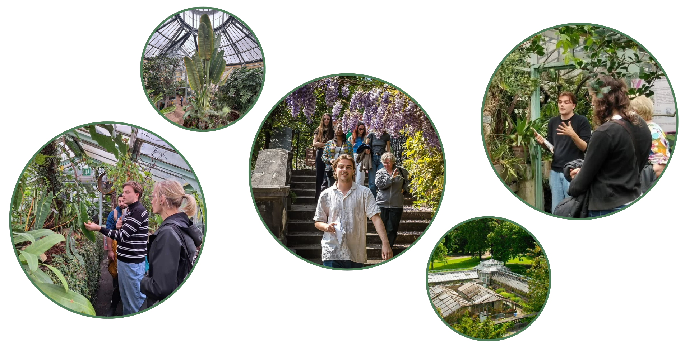
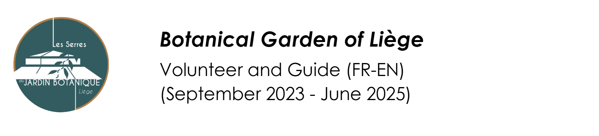
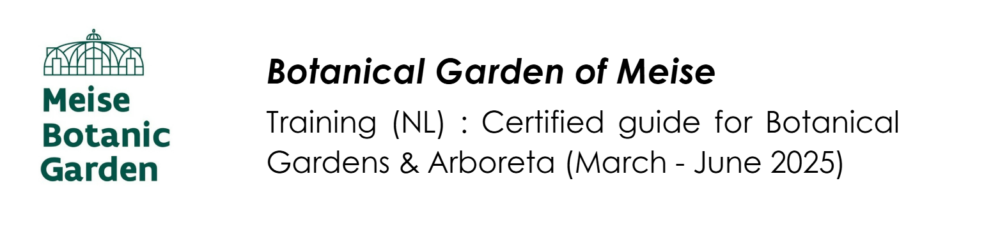
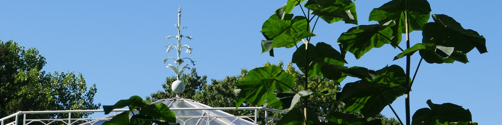
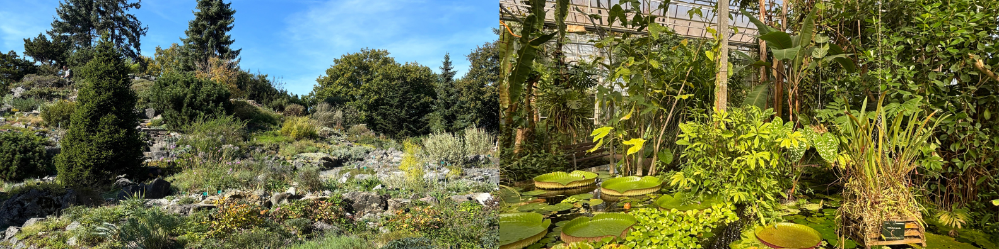

## Botanical gardens & cie 

This section is a lighter space for botanical curiosity and exploration. Apart from Botanical Gardens being  little heavens on Earth, they're also proven to boost your mental health! Having gotten into the habit of recharging my batteries in these places, I also enjoy sharing my love for the nation of plants with visitors. I am currently active at the Hortus of Amsterdam, the Botanical Gardens of the University of Utrecht and the Botanical Garden of Liège.Here I moslty display botanical and historical content. I also regularly update a **Plant Catalogue** where you can find pictures of plants that really made me think *"wow"* or *"what the hell ?"* or *"this is SO COOL"* along with some juicy anectodes. All pictures you'll find there are taken by myself using a LUMIX G7K camera 📷 for close angles, or my phone 📱. This place is meant to be a sort of depository, I also display this content (and more) on this public **Instagram account**.

&nbsp; &nbsp;
<a href="plant_catalogue.qmd" 
   class="custom-button"
   style="padding: 12px 24px; font-size: 1rem;">
My Plant Catalogue
</a>

<a href="https://www.instagram.com/bergenhuizen_lucas/" 
   class="custom-button"
   target="_blank"
   style="padding: 12px 24px; font-size: 1rem;">
Instagram Account
</a>

{fig-align="center"}

### My botanical education journey 

{width=70%}

I started volunteering at the the Botanical Garden of Liège in 2023 to learn more about plant conservation work and the educational approach specific to this type of institution. So having a lot of free time to spent before getting busy with my master's thesis, I first did a scientific literature review to create content suited for information panels for the different greenhouses. During this volunteering period, I also gave my first guided tours and I kept doing so for a year, where I had a real pleasure sharing the history of the garden and other plant stories with the visitors.

{width=70%}

 Even though I already had this first experience, I wanted to take a formal training to strengthen my theoretical knowledge and improve my educational skills. To do so, I did a bit of volunteering and spent some time at the Botanical Garden of Meise (aka Belgium's national treasure). In Meise, I followed a 42 hours practical and theoretical training in Dutch held across various botanical gardens and arboreta in Flanders. There I learned a lot more about the educational roles of botanical gardens, guiding techniques, plant evolution, systematics, ecology, ethnobotany and ecological interactions ([certificate](images/certificatemeise.jpg)).

{width=70%}

After moving to the Netherlands, it felt urgent to join another garden. And instead of joining one, I actually joined two. So I am now enrolled as a volunteer guide at the Hortus of Amsterdam and at the Botanical Gardens of the University of Utrecht where I try to regularly stay active and keep learning about their beautiful collections.

### Choose a spot ! 

Here you'll find a small desciption of the gardens I volunteer at along with some interesting fun facts  

::: {.grid}

::: {.g-col-4}

<a href="botaliege.qmd" style="text-decoration: none; color: inherit;">

:::{.card}

Botanical Garden of Liège

:::

</a>

:::

::: {.g-col-4}

<a href="hortus.qmd" style="text-decoration: none; color: inherit;">

:::{.card}

Hortus Amsterdam

:::

</a>

:::

::: {.g-col-4}

<a href="botautrecht.qmd" style="text-decoration: none; color: inherit;">

:::{.card}

Botanical Gardens Utrecht

:::

</a>

:::

:::