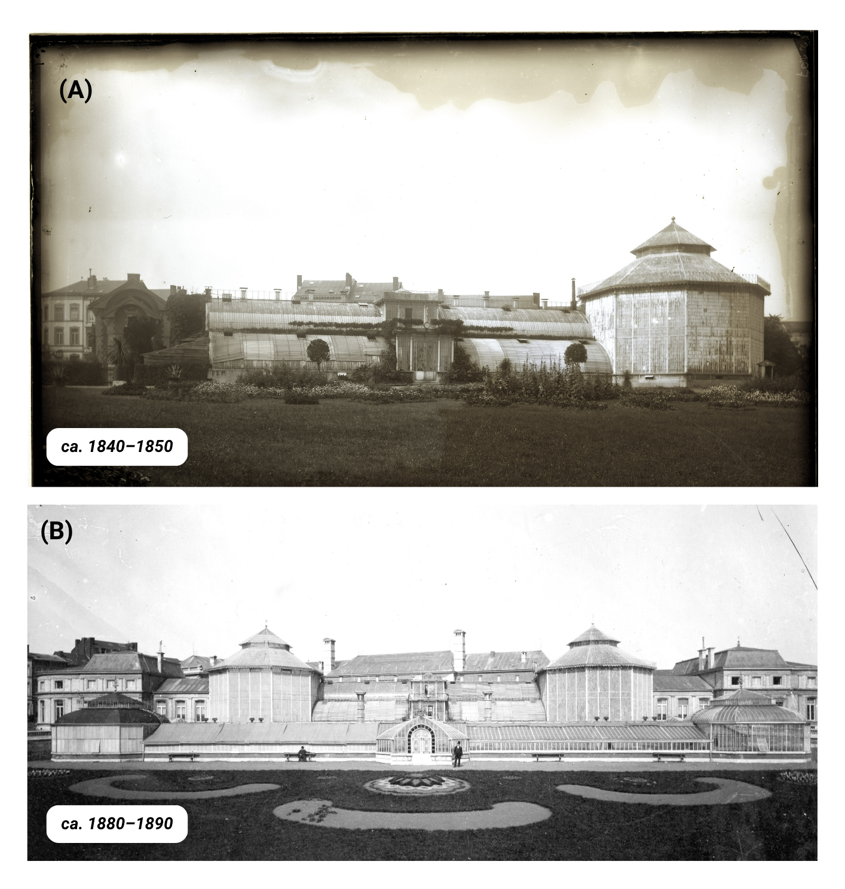
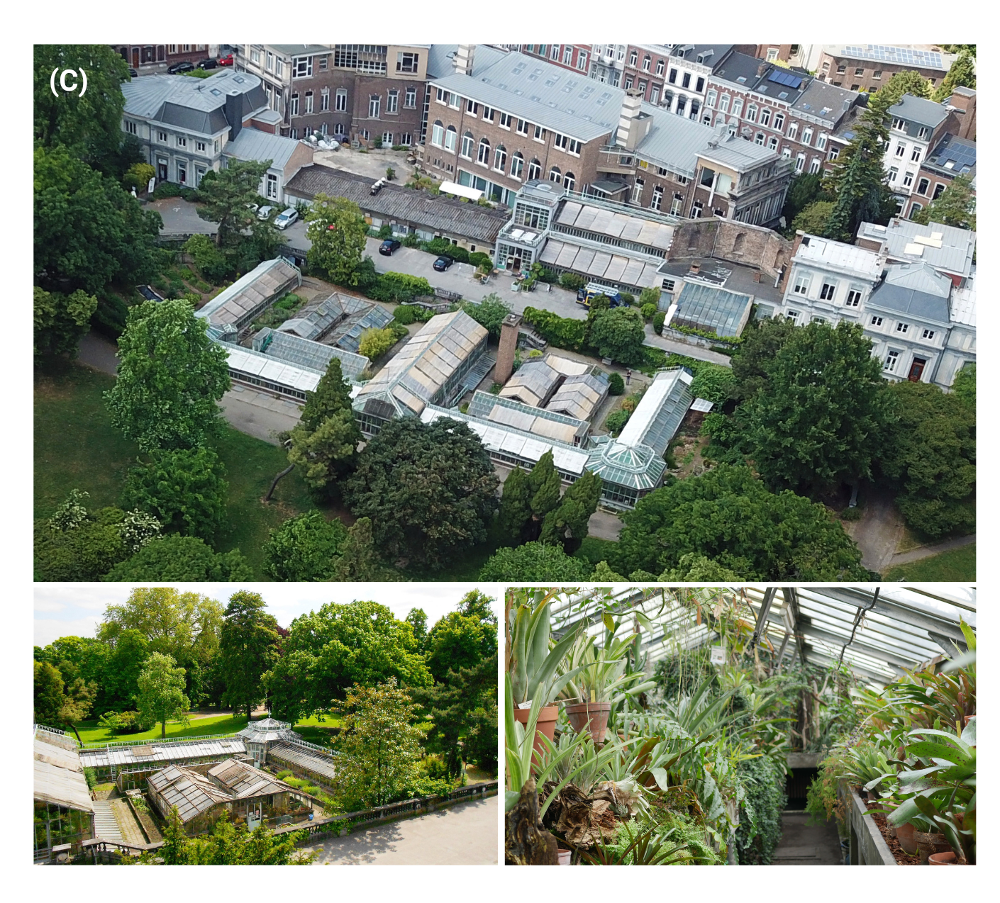
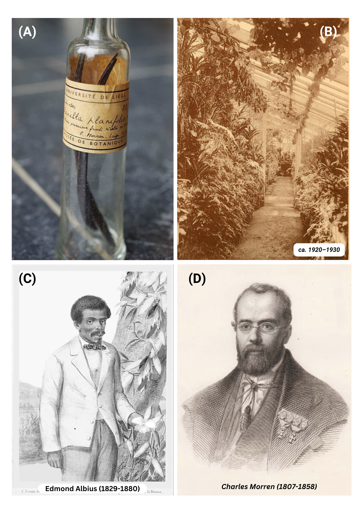

<div style="text-align: justify;">

# The Botancial Garden of Liège 

The Botanical Garden of Liège is the former botanical garden of the University of Liège (Belgium). Located not far from the city center, the site is a true green oasis within the urban landscape. This place, which is particularly close to my heart, is an incredible source of historical and scientific anecdotes, which I have taken great pleasure in summarizing down below. 

## A brief history 

The history of its creation is a genuine Liège-style saga, marked by budget cuts and construction works that were significantly delayed. The construction of the botanical garden started in 1841 and included greenhouses inspired by the Victorian English style. However, only two years after work had started, construction was halted in 1843 due to a lack of funding. At that point, only one third of the original project had been completed **(A)**, including the foundations, the central greenhouses, and a rotunda (a circular greenhouse).

Charles Morren, the former director and initiator of the project, fell ill in 1856 and died in 1858. His son, Edouard Morren, succeeded him. In 1875, the academic council decided to transfer several institutes onto the site of the unfinished botanical garden, including the departments of botany, zoology, and comparative anatomy. The construction of these new institutes progressed slowly, but work on the greenhouses finally resumed after these chaotic developments in 1881, that is, 40 years after the original project had begun. This new construction phase introduced E-shaped greenhouses below the first greenhouse complex, and a second rotunda on the left was added, as a replica of the one built on the right side forty years earlier, both separated by an ornamental terrace. The works ultimately led to the inauguration of the complex in 1883 **(B)**, three years before the death of Edouard Morren in 1886.




By the beginning of the twentieth century, the entire site could reasonably be considered fully operational, with no major architectural changes to report. By the mid-twentieth century, the greenhouses housed around 7,600 specimens representing 2,370 plant species, including remarkable collections of Bromeliads assembled by the Morren family, which continued to be studied by botanists from the University.This prosperous period came to an abrupt end during the Second World War, in the winter of 1944, when a bomb destroyed part of the greenhouses and highly damadged the rotundas, later taken down, and resulting in the loss of numerous plant species. Only a partial reconstruction was carried out in 1954 because the compensation received for war damages was insufficient to fully restore the complex. Despite this setback, the site remained an important center for scientific research. In 1950, Professor Raymond Bouillenne launched the first phytotron in Europe, and it continued operating until 1981. Here below you can see a cool archive footage of the gardens and the phytotron, featuring the water cooling and ligthing systems.

<br>

```{=html}
<div style="text-align:center;">

<video controls style="max-width:650px;">
  <source src="videos/phytotron50.mp4" type="video/mp4">
</video>

</div>
```
<br>

Another important event took place in 1961, when part of the botanical garden’s collections was transferred to newer and more modern greenhouses on the new science campus located at the Sart-Tilman, above the city. Around the same time, the fences surrounding the garden and its park were removed, allowing the former botanical garden to become a public park managed by the City of Liège. The University continued to oversee the management of this heritage until 2014, before transferring responsibility to the Maison Liégeoise de l’Environnement (NPO). Since then, the site has officially been maintained by the volunteer association “Les Serres du Jardin Botanique”, which continues to preserve and share its history through a variety of activities and thematic visits. Nowadays, the E-shaped greenhouse complex **(C)** is still visitable and host an impressively diversified collection of plant, with two separated greenhouses dedicated to 1) carnivorous and peatland plants and 2) succulents and cacti. The historical main entrance on the top-side, now hosts "Le péristyle", a lovely space including a small cabinet of curiosities, a botanical shop, and a greenhouse area where you can enjoy local drinks and snacks or a cup of coffee. More info over this little gem on [their website](https://botaniqueliege.be/) and [Facebook page](https://www.facebook.com/serres.amis.7). 



## ​The origins of Vanilla’s hand-pollination: A Belgian legacy 🌿​

I have another captivating story to share over a recently resurfacing fact about the Botanical Garden of Liège: this is where the first-ever artificial pollination of Vanilla was made and reported. In 1836, Charles Morren, botanist and director of the garden, became the first to successfully achieve artificial pollination of the Vanilla orchid (Vanilla planifolia). This work was performed at the former location of the garden, in the greenhouses located back then right behind the University’s main building. His meticulous experiments and subsequent publications laid the groundwork for global vanilla cultivation and that is also how he secured the necessary funds to build the new botanical garden. His pollination method, however, was very labour-intensive and consisted mainly in cross-pollinating two flowers to obtain the much-coveted pods. In 1841, a much more efficient self-pollinating technique was developed on the island of La Réunion by a twelve-year-old slave, Edmond Albius, another important prominent figure in the history of Vanilla cultivation who contributed to the market's rapid expansion. On the pictures below you can see on **(A)** the first vanilla pods produced in 1837 and conserved in a glass bottle, **(B)** a picture of a greenhouse in the early 1900's were we can see a Vanilla plant growing on the top left (the plant is still there nowadays, and DNA analyses are being done to check if it might be the descendant of the plant used by Morren for his experiments), **(C)** Edmond Albius's portrait standing next to a Vanilla plant and **(D)** Charles Morren's portrait.  



 
This (re-)discovery was recently investigated by A. Karremans, Director of Lankester Botanical Garden and tropical botanist who traveled all the way from Costa Rica to Liège to retrace the history of Vanilla cultivation, which led to the publication of a very interesting article. If you’d like to learn more about it, here is the link: [Karremans, A. P. (2024). A Historical Review of the Artificial Pollination of Vanilla planifolia: The Importance of Collaborative Research in a Changing World. Plants, 13(22), 3203.](https://doi.org/10.3390/plants13223203)


</div>