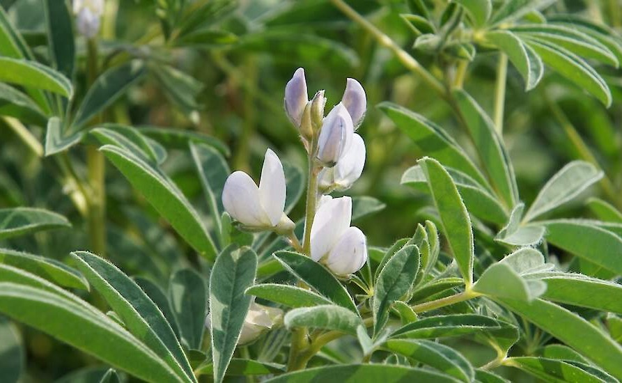
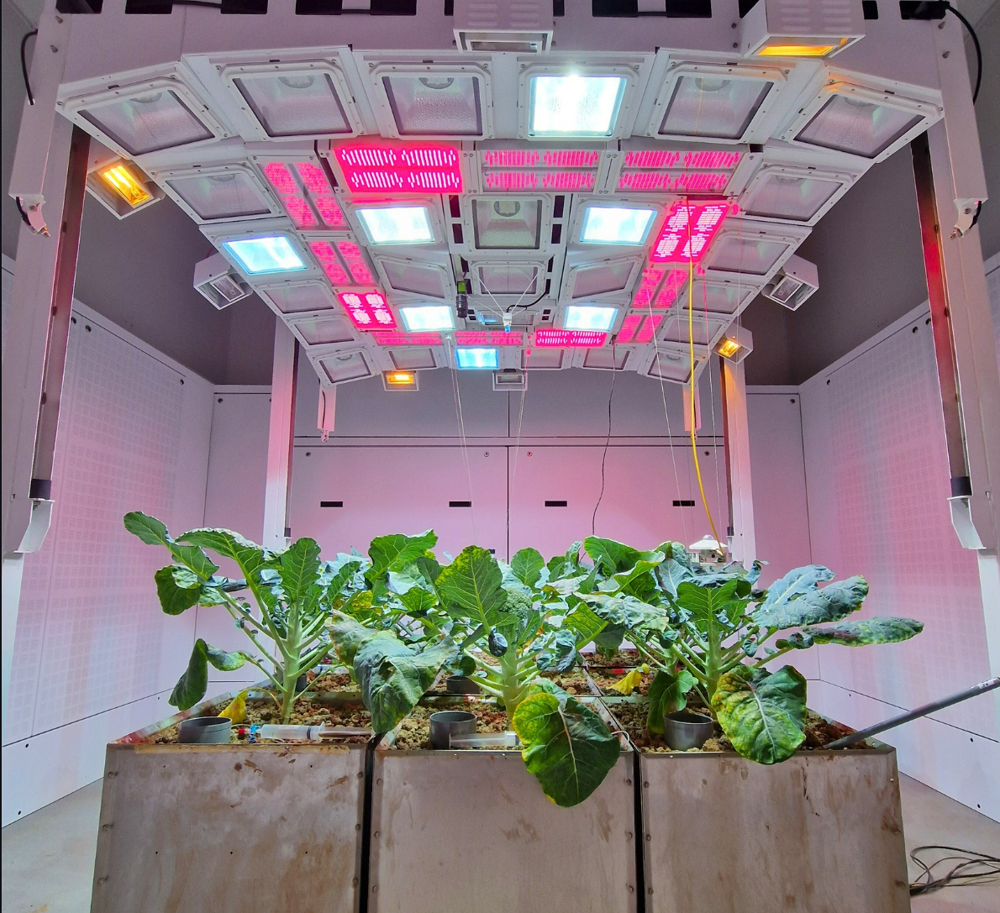
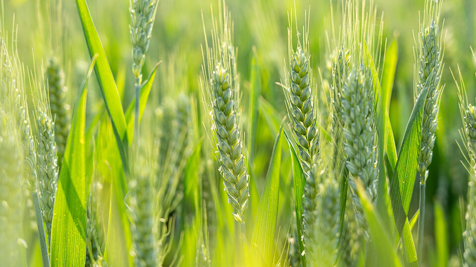

This section showcases my scientific contributions from different projects with graphical abstracts, key findings, data visuals and behind the scenes content 📹 

## Projects

::: {.grid}

::: {.g-col-4}

<a href="reap2sow.qmd" style="text-decoration: none; color: inherit;">

:::{.card}

#### REAP2SOW

Plant-soil interactions in novel protein crops

:::

</a>

:::

::: {.g-col-4}

<a href="sea2land.qmd" style="text-decoration: none; color: inherit;">

:::{.card}

#### SEA2LAND

Bio-based fertilizers for the broccoli of the future

:::

</a>

:::

::: {.g-col-4}

<a href="biofair.qmd" style="text-decoration: none; color: inherit;">

:::{.card}

#### BIOFAIR

A geogradient of contrasted wheat agrosystems

:::

</a>

:::

:::

## Publications

<a href="https://iopscience.iop.org/article/10.1088/2976-601X/ae2d5b" style="text-decoration: none; color: inherit;">

::: {.pub-card}

2026

Bio-based fertilizers can reach agronomic performance of synthetic fertilizer in broccoli production under two climate scenarios

• Environmental Research: Food Systems

**Lucas Bergenhuizen**, Vincent Leemans, Jimmy Bin, Caroline De Clerck, Pierre Delaplace, Jingsi Zhang, Çağri Akyol, Marta Aranguren, Miriam Pinto, Matthias Waibel, Sarah Symanczik, Bente Foereid, Hervé Vanderschuren, Cécile Thonar and Jennifer Michel

:::
</a>