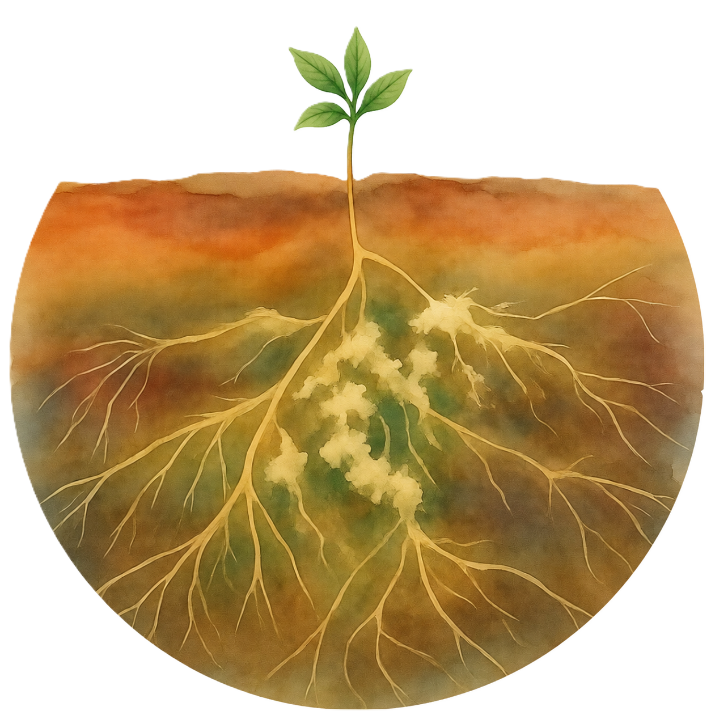

  

::: {.columns v-align="middle" style="height: 80vh; align-items: center; column-gap: 8.0rem;"}

::: {.column width="50%"}

Lucas Bergenhuizen

PhD Candidate in Plant-Soil Interactions 🌱🦠

<!-- ICONS -->

  <a href="mailto:lucas.bergenhuizen@wur.nl" target="_blank" style="font-size: 1rem;"><i class="bi bi-envelope"></i></a> &nbsp;
  <a href="https://github.com/lucasbergenhuizen" target="_blank" style="font-size: 1rem;"><i class="bi bi-github"></i></a> &nbsp;
  <a href="https://scholar.google.com/citations?user=Hz5hD70AAAAJ&hl=en&oi=ao" target="_blank" style="font-size: 1rem;"><i class="bi bi-globe"></i></a> &nbsp;
  <a href="https://www.researchgate.net/profile/Lucas-Bergenhuizen-2?ev=hdr_xprf" target="_blank" style="font-size: 1rem;"><i class="bi bi-mortarboard-fill"></i></a> &nbsp;
  <a href="https://www.linkedin.com/in/lucas-bergenhuizen/" target="_blank" style="font-size: 1rem;"><i class="bi bi-linkedin"></i></a> &nbsp;
  <a href="https://orcid.org/0009-0005-5104-6839" target="_blank" style="font-size: 1rem;"><i class="bi bi-person-badge"></i></a>

I am a plant scientist with a huge interest in soils, agroecology, ecosystem functioning and more widely, botany. I am currently doing a PhD on plant-soil interactions in novel protein crops at Wageningen University. On this website, I will share some pieces of my academic journey but also some more personal content, so if you're into sustainable agriculture, plant-soil dynamics or botancial fun facts, you might find some cool stuff here

<a href="about.qmd" class="custom-button">
  Learn more about me →
</a>

:::

::: {.column width="40%"}

:::

:::