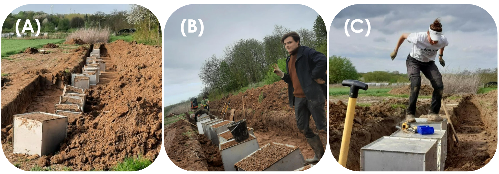
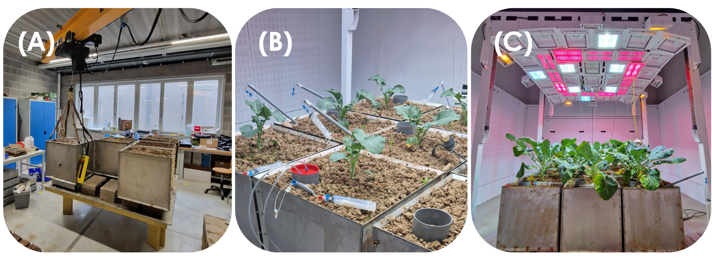
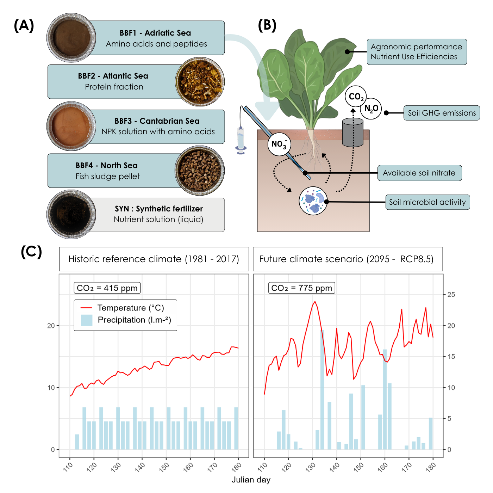
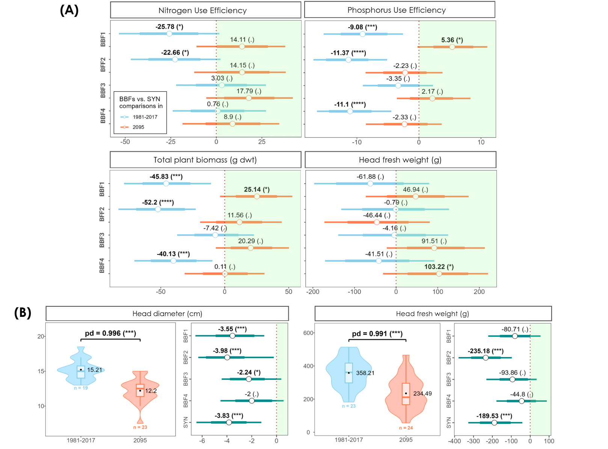
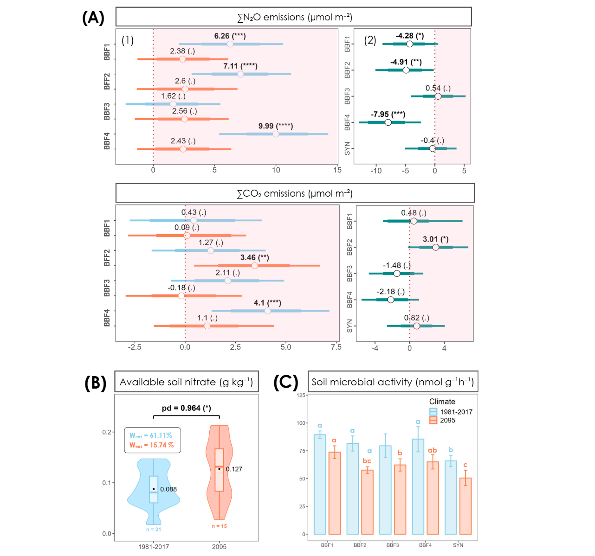
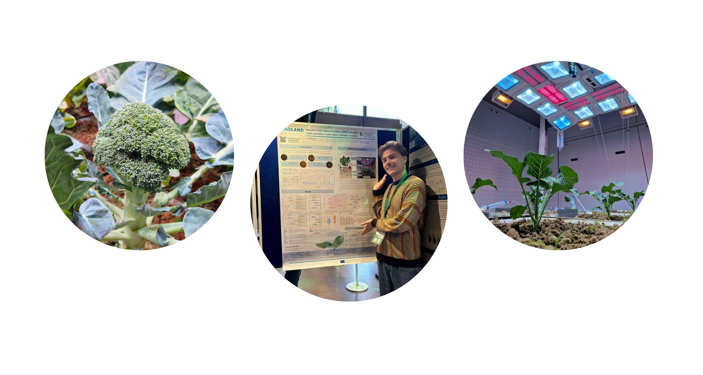

# SEA2LAND : Production of advanced bio-based fertilisers (BBFs) from fishery waste

SEA2LAND was funded to provide solutions to help overcome challenges related to food waste, nutrient imbalance and imported fertilizer's dependancy in Europe. Based on the circular economy model, the project promoted the production of large-scale bio-based fertilizers (BBFs) from fishery waste produced across EU's main aquatic regions. The project proposed the implementation of several nutrient recovery technologies representative of the regional fisheries sector to increase local resource efficiency and make crop production more sustainable [Link to the project website](https://sea2landproject.eu/sea2land/overview/)

## Work Package 5 : Agronomic studies

WP5 focused on the evaluation of the BBFs performance on cropping systems, through the study of nutrient mineralisation rates, pH-changes and greenhouse gas (GHG) emissions in incubation experiments. Nutrient uptakes were also evulated in greenhouse and field experiments and the agronomic and environmental performances were studied under contrasting environmental conditions across Europe.

### An Ecotron experiment to evaluate new BBFs under future climate 🌡️🌦️

My master's thesis consisted in setting up a climate-controlled mesocosm experiment to study the efficiency and environmental impact of these newly produced fish-based fertilizers on ... broccoli 🥦. But why broccoli ? Even if it looks a bit random, there's an increasing demand for this crop on the world market due to its high nutritional value, and it was commonly grown across the various project's partners, all the way from Norway to Spain. And let's be honest it's also way better looking than wheat (sorry wheat lovers). Anyway, a big motivation behind this project was that studies integrating climate resilience and cropping system compatibility into (bio-)fertilizer development were still pretty scarce. However such assessement could help anticipate potential fertilizer weaknesses and develop formulations which meet the dual challenge of maintaining agricultural productivity and reducing environmental harm under "unusual" climate scenarios. Here below I will guide you through the main steps and key findings of this work.  

#### **Setting up the experiment: step 1) dig baby, dig !**

The thing with climate-controlled experiments is ... you most of the time have to bring the field/ecosystem to a climate facility, and the bigger the scale, the bigger the excavation. This experimental design required filling 56 cubes (50x50cm) with suitable field soil and keep them as intact as possible to not disturb the lil microbes and other bigger inhabitants (we did our best). Here below you can see **(A)** a fully extracted trench, **(B)** posing between two cube screwing sessions and **(C)** a supervisor showing how you get it done 🤸‍♀ 

#### **Setting up the experiment: step 2) Back to TERRA** 

Luckily, our field was not so far from our research center (TERRA) hosting the Ecotron facility. After transporting all these cubes, we **(A)** placed them accordingly on the platforms, **(B)** let them acclimatize to the climate chambers before setting up all the devices (incl. rhizons for pore water sampling and PVC tubes for GHG emissions measurements), applying the fertilizers and planting the broccolis. The following weeks were then dedicatd to measuring, monitoring and watering the cubes displayed across the six climate chambers **(C)**.  

#### **What did we test and what did we look at exactly ?**   

All the newly produced bio-fertilizers differed greatly in terms of origins, formulation and nutrient content **(A)**.The goal was to assess and compare the efficiency of these fertilizers to a synthetic one (SYN) in terms of plant performance (measured as nutrient efficiencies for N and P and other relevant plant parameters) and in terms of environmental impact (we looked at soil N₂O & CO₂ emissions,  plant-available nitrate (NO₃⁻) and overall soil enzymatic activity) on each cube replicate **(B)**. While this is already a great objective on its own, the TERRA-Ecotron was specifically chosen to test these products under strongly contrasted climate scenarios **(C)**. One scenario serving as a control climate aiming to provide a favorable environment for crop growth and fertilizer uptake, and a future projection of meteorological conditions characterized by higher atmospheric CO₂ concentrations, higher temperatures and more intense rain/drought events. 

#### **What did we find out ?**   

On these figures **(A)**, each BBF is compared to SYN, thus a shift in the green zone means higher values for BBFs compared to SYN, with blue or red colours referring to the climate scenario. Interstingly, crop production parameters such as nitrogen, phosphorus use efficiencies and yield (here measured as plant biomass and head fresh weight) were similar or lower for plants receiving BBFs compared to SYN in the reference climate (blue lines), but similar or higher for BBFs compared to SYN in the future climate (red lines shifting into the green zone). Meaning: plants receiving BBFs tend to do better than synthetically fertilised plants in the future. However, we also observed severe yield penalties in the future climate **(B)** with lower values for all fertilizers (here by comparing the data between climates, a shift into the green zone would refer to higher values in the future climate).

Now what about the soil ? Did the microbes survive this dramatic 2095 future climate ? Of course they did ! Mechanistically, we saw that cropping systems fertilized with BBFs benefited from enhanced soil microbial activity compared to SYN in both climates **(C)**, but concurrently also had higher N₂O & CO₂ emissions (panel **(A)**, all comparisons of SYN to BBFs showed similar or higher estimates). While it is generally predicted that N₂O emissions from agricultural land will increase in the future (due to higher temperatures inceasing denitrifiers activity), in this experiment, mostly decreased fluxes were observed in the future climate (right side panel **(A)** for climate comparison). We can explain that by the drier soil conditions in the future climate, which has been previously linked to reduced soil N₂O emissions (lower moisture levels = more oxygen available = reduced denitrification = decreased emissions). Despite these drier conditions, plant available soil nitrate was on average increased in the future climate **(B)**, probably due to the heavier rainfalls but the risk of nitrate leaching was indifferent amongst fertilizers. 

### **The limitations** 

In every study we have to acknowledge some limitations. A first important thing to remember with this work is that it was a typical case study experiment. Though we can justifiy every choice we made, we have a belgian soil from a very specific region, we tested only a single cultivar of one plant species, used new biofertilizers not yet fully replicable, used only one very specific synthetic control and applied a future climate scenario based on local climate data. Looking closely at the broad credible intervals, we know that the variance was systematically high in the data. Still, despite these limitations and the specificity of the system, we observed clear and interesting trends. And I think this is where the value of this type of exploratory research lies: not necessarily in immediately extrapolating the results to global large-scale systems, but in exploring original questions and identifying potential important mechanisms to generate new ideas and hypotheses for future work. If such trends can already emerge in our very specific belgian context, it means there may be even stronger effects once the system is better optimized and studied under a wider range of conditions. 

### **The conclusion** 

This study revealed a complex interplay between climate and fertilizers stressing the importance of considering the multifactorial nature of climate change and dynamic interactions between fertilizers, plants, soils and soil organisms. While these results support BBFs as agronomic alternatives to SYN, especially under harsher climatic conditions, further research is needed to address climate-induced yield penalties, ensure efficiency across diverse pedo-climatic contexts and improve their environmental footprint. We suggested for instance to  start selecting cultivars based on their compatibility with BBFs, rather than only on their climate-resilience. To optimize BBFs implementation, designing experiments including interacting factors such variety × soil × management × season interactions would help indentifying the different trades-off and synergies. Further research could also take the production processes and related resource and energy use into account to efficiently assess the environmental viability of BBFs.  

### Want to check some things in more detail ? 👇

If you are curious about the methods, statistical analysis or more in depth-results and discussions of this study, here is the link to the full article :

[**Bio-based fertilizers can reach agronomic performance of synthetic fertilizer in broccoli production under two climate scenarios. *Bergenhuizen L., et al.* (2026)**  
*Environmental Research: Food Systems*](https://iopscience.iop.org/article/10.1088/2976-601X/ae2d5b)

A poster was also made if you want to share the (very) summarized version of this work : 

[**Benefits of bio-based fertilisers (BBFs) despite yield penalties under future climate scenario. *Bergenhuizen L., et al.* (2025)**  
*Recycling of Agricultural, Municipal and Industrial Residues in Agriculture Network (RAMIRAN), Wageningen 15-17 October 2025*](https://www.researchgate.net/publication/397839394_Benefits_of_bio-based_fertilisers_BBFs_despite_yield_penalties_under_future_climate_scenario)

 

Thank you for reading 🥦

