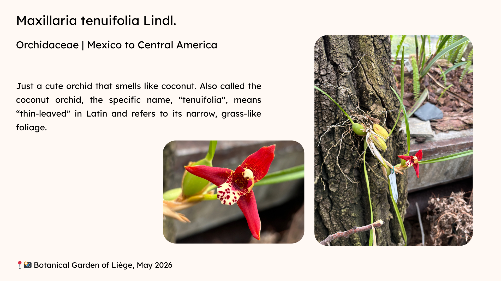
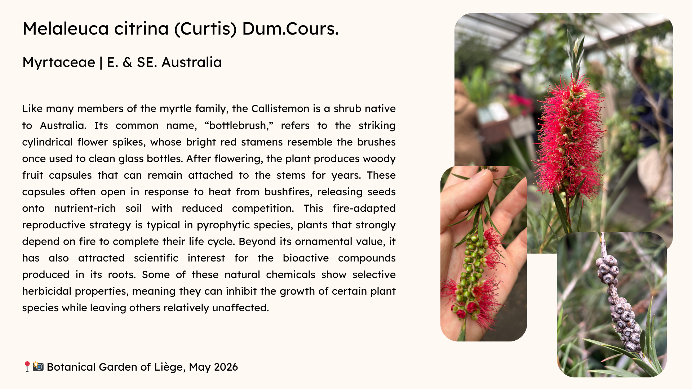
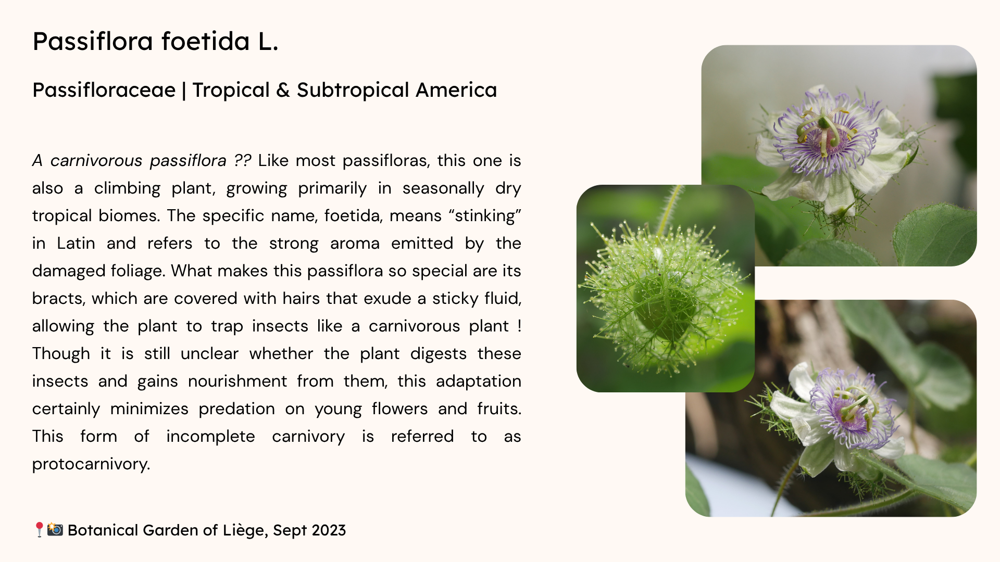
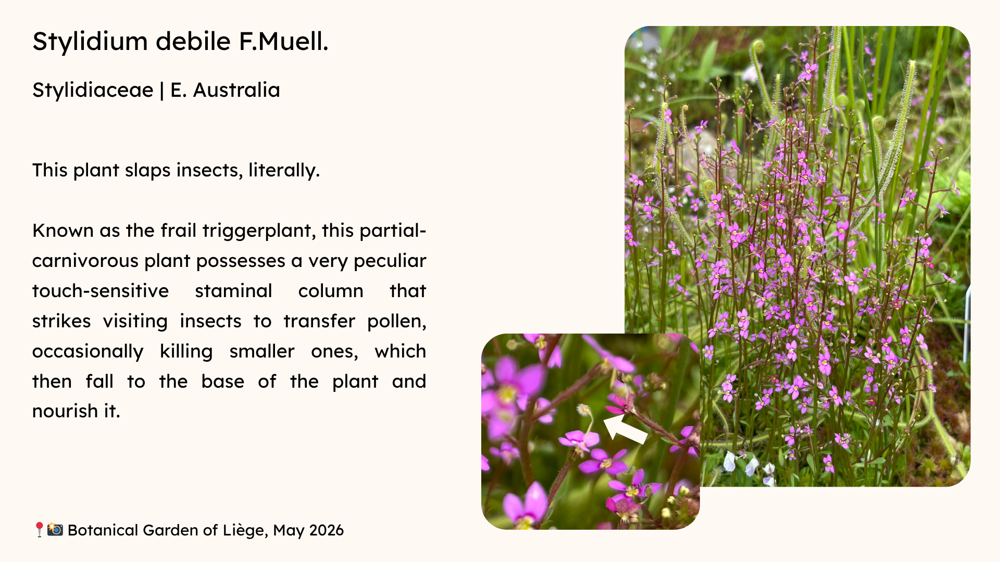
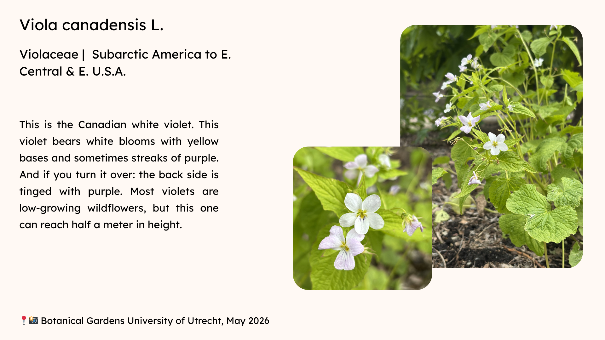

Here you can find a depository of my most precious botanical anectodes. Every plant has a story to tell, but the way we connect with them is also deeply personal. So while browsing this catalogue, do not be surprised to encounter for instance quite a few violets while going through the "V" section. If you prefer a more spontaneous approach, you can also use this magic button to randomly pick a plant card. Maybe you'll learn something!

<button onclick="randomPlant()" class="btn btn-success">
Magic button, show me a random plant
</button>

 

NB: If you ever visit the places where these pictures were taken in search of the species, please note that I cannot guarantee they are still there, as I am not fully aware of the evolution of these botanical collections (or mother nature's gardening plans).

 

<a href="#A">A</a> |
<a href="#B">B</a> |
<a href="#C">C</a> |
<a href="#D">D</a> |
<a href="#E">E</a> |
<a href="#F">F</a> |
<a href="#G">G</a> |
<a href="#H">H</a> |
<a href="#I">I</a> |
<a href="#J">J</a> |
<a href="#K">K</a> |
<a href="#L">L</a> |
<a href="#M">M</a> |
<a href="#N">N</a> |
<a href="#O">O</a> |
<a href="#P">P</a> |
<a href="#Q">Q</a> |
<a href="#R">R</a> |
<a href="#S">S</a> |
<a href="#T">T</a> |
<a href="#U">U</a> |
<a href="#V">V</a> |
<a href="#W">W</a> |
<a href="#X">X</a> |
<a href="#Y">Y</a> |
<a href="#Z">Z</a>

---

## A {#A}

## B {#B}

## C {#C}

## D {#D}

## E {#E}

## F {#F}

## G {#G}

## H {#H}

## I {#I}

## J {#J}

## K {#K}

## L {#L}

## M {#M}

### *Maxillaria tenuifolia Lindl.*

{width=400px}

### *Melaleuca citrina (Curtis) Dum.Cours.*

{width=400px}

## N {#N}

## O {#O}

## P {#P}

### *Passiflora foetida L.*

{width=400px}

## Q {#Q}

## R {#R}

## S {#S}

### *Stylidium debile F.Muell.*

{width=400px}

## T {#T}

## U {#U}

## V {#V}

### *Viola canadensis L.*

{width=400px}

## W {#W}

## X {#X}

## Y {#Y}

## Z {#Z}

