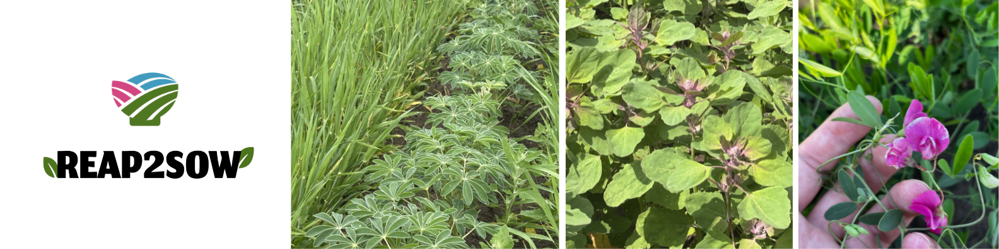
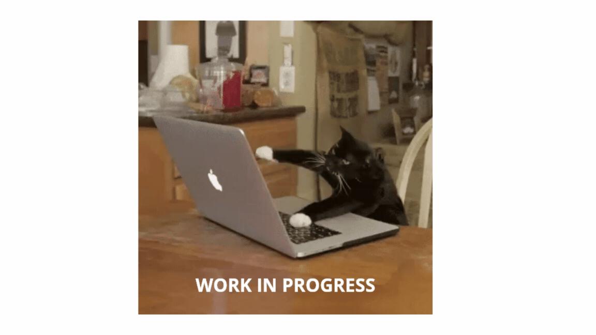

## REAP2SOW: Resilient and Efficient Agricultural Proteins to Sustain Our World

REAP2SOW is a multi-actor collaborative effort to shift the protein consumption of the Dutch public to 70% plant-based by 2050. The project aims to do this by developing three novel crops (quinoa, white lupin, aardaker) that have great potential to enhance biodiversity, improve soil health, and support the protein transition. Through its interlinked workpackages, the project integrates research on breeding, soil ecosystem functions, cultivation practices, consumer behavior, health impacts, historical perspectives and supply chains. [Link to the project website](https://reap2sow.nl/) 

## Work package 3 : Soil biodiversity and functioning

This work package focuses on how climate-resilient food systems and novel protein crops can enhance soil ecosystem functions, such as biodiversity, water stress resilience, and carbon sequestration. Soil organic carbon, supported by plant roots and the soil microbiome, is crucial for linking water-stress resistance and biodiversity. A well-functioning soil boosts crop resilience to pests and water stress by improving soil structure, carbon storage, and plant-microbe interactions. However, little is known about how increasing protein crop cultivation might impact our soils. This WP will study the soil root interface and microbiomes to assess the opportunities and challenges of their implementation in Dutch cropping systems.

## My research focus 

My research specifically looks at the role of their root exudates and residues in soil organic matter build-up and other soil properties, combining on farm and greenhouse trials.

