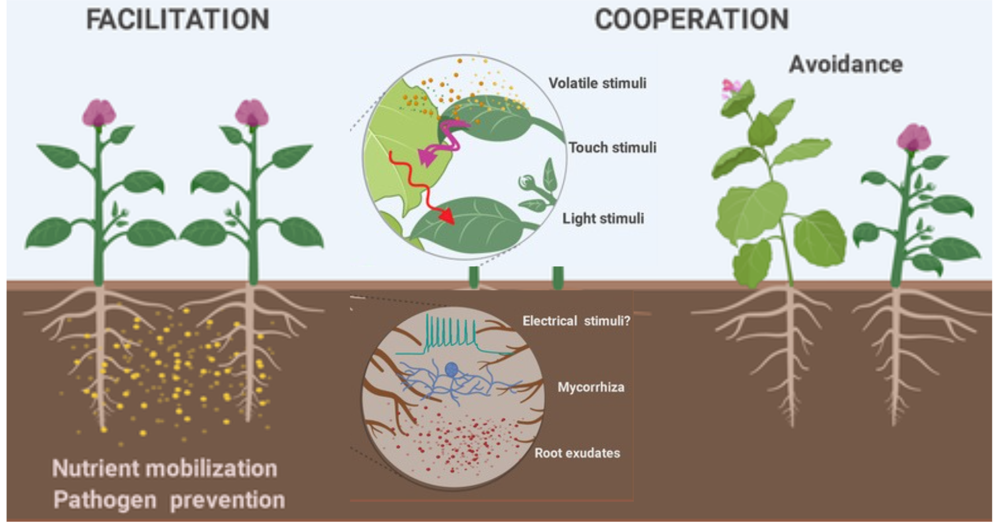

## Knowledge deep dives

This section is dedicated to making (and with time updating) small reviews, sharing and simplifying papers or key concepts that I find particularly interesting. I also added a comment section (connection through GitHub profiles), so if you want to add something or share a thought, please do!  

```{=html}
<div class="filter-buttons">

<button class="filter-btn active" onclick="filterSelection('all')">All</button>

<button class="filter-btn" onclick="filterSelection('soil')">
Soil processes
</button>

<button class="filter-btn" onclick="filterSelection('psi')">
Plant-soil interactions
</button>

<button class="filter-btn" onclick="filterSelection('ppi')">
Plant-plant interactions
</button>

<button class="filter-btn" onclick="filterSelection('rhizosphere')">
To the rhizosphere
</button>

<button class="filter-btn" onclick="filterSelection('agriculture')">
Agriculture
</button>

<button class="filter-btn" onclick="filterSelection('community')">
Community Ecology
</button>

<button class="filter-btn" onclick="filterSelection('microbes')">
Microbes
</button>

<button class="filter-btn" onclick="filterSelection('climate')">
Climate change
</button>

<button class="filter-btn" onclick="filterSelection('volunteering')">
Botany
</button>

</div>

<div id="card-grid" class="card-grid">

<div class="card" data-categories="ppi psi community">
  <a href="Scicom/Bilas2020.qmd">
    
    <div class="card-content">
      <h3>Plants have a social life too</h3>
      <p>June 28, 2026</p>
    </div>
  </a>
</div>

<!-- Add more cards here, one per article, following the same structure -->

</div>

<script>
function filterSelection(category) {
  document.querySelectorAll('.filter-btn').forEach(btn => btn.classList.remove('active'));
  event.target.classList.add('active');

  const cards = document.querySelectorAll('.card');
  cards.forEach(card => {
    if (category === 'all') {
      card.style.display = '';
    } else {
      const cats = card.getAttribute('data-categories').split(' ');
      card.style.display = cats.includes(category) ? '' : 'none';
    }
  });
}
</script>
```

## Social events 

This section is dedicated to sharing practical events and talks that I’ll be giving or attending within various plant–soil science communities.

```{=html}
<div class="filter-buttons">

<button class="filter-btn active" onclick="filterSelection('all')">All</button>

<button class="filter-btn" onclick="filterSelection('conference')">
Conferences
</button>

<button class="filter-btn" onclick="filterSelection('workshop')">
Workshops
</button>

<button class="filter-btn" onclick="filterSelection('talks')">
Talks
</button>

</div>

<!-- Add more cards here, one per article, following the same structure -->

</div>

<script>
function filterSelection(category) {
  document.querySelectorAll('.filter-btn').forEach(btn => btn.classList.remove('active'));
  event.target.classList.add('active');

  const cards = document.querySelectorAll('.card');
  cards.forEach(card => {
    if (category === 'all') {
      card.style.display = '';
    } else {
      const cats = card.getAttribute('data-categories').split(' ');
      card.style.display = cats.includes(category) ? '' : 'none';
    }
  });
}
</script>
```